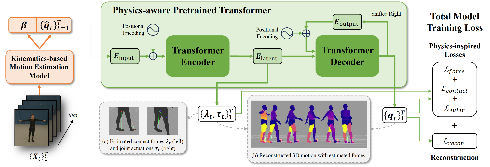

# **<ins>PhysPT</ins>: <ins>Phys</ins>ics-aware <ins>P</ins>retrained <ins>T</ins>ransformer for Estimating Human Dynamics from Monocular Videos** <br />
  [Yufei Zhang](https://zhangy76.github.io/), Jeffrey O. Kephart, Zijun Cui, Qiang Ji <br /> 
  CVPR2024, [arXiv](https://arxiv.org/abs/2404.04430) <br />



This repositoray provides the PhysPT demo code for estimating human dynamics from a monocular video. 


## Environment Setup
```bash
conda create -n physpt python=3.7
conda activate physpt
pip install -r requirements.txt
```

## Model and Data Download
Please download the required data and trained model [assets](https://www.dropbox.com/scl/fo/x9yor045ztrcv6rav4pz2/AMDO2krghJF_spnxNc5d9nE?rlkey=epj0vkwoafyp48rz7lp5im1o0&dl=0) and directly overwrite the ./assets folder in the current directory. (please also download the checkpoint [CLIFF](https://www.dropbox.com/scl/fi/1zyefhokc2seull2un8bt/hr48-PA43.0_MJE69.0_MVE81.2_3dpw.pt?rlkey=0hidvwxdi7g7770it04ncalyh&dl=0) and put it under ./models/cliff_hr48 used for generating kinematics-based motion estimates)


## Evaluation on a Video
#### 1. Estimate per-frame 3D Body Pose and Shape (CLIFF)
```bash
python video_preprocessing.py --vid_path './demo/jumpingjacks'
```
#### 2. Generate Improved 3D Motion Estimates and Infer Forces
```bash
python video_inference.py --vid_processed_path './demo/jumpingjacks_CLIFF.json'
```
#### 3. Visualize the Motion and Forces 
```bash
python vis_motion_force_withvideo.py --vid_output_path './demo/jumpingjacks_output.npz'
```


## Citation
If you find our work useful, please consider citing the paper:
```bibtex
@InProceedings{Zhang_2024_CVPR,
    author    = {Zhang, Yufei and Kephart, Jeffrey O. and Cui, Zijun and Ji, Qiang},
    title     = {PhysPT: Physics-aware Pretrained Transformer for Estimating Human Dynamics from Monocular Videos},
    booktitle = {Proceedings of the IEEE/CVF Conference on Computer Vision and Pattern Recognition (CVPR)},
    month     = {June},
    year      = {2024},
    pages     = {2305-2317}
}
```

If you have questions or encouter any issues when running the code, feel free to open an issue or directly contact me via: zhangy76@rpi.edu.

## References
The SMPL model data is downloaded from [SMPL-X model](https://github.com/vchoutas/smplx). The adaptation of the CLIFF model is based on [CLIFF](https://github.com/haofanwang/CLIFF). We thank them for generously sharing their outstanding work.
